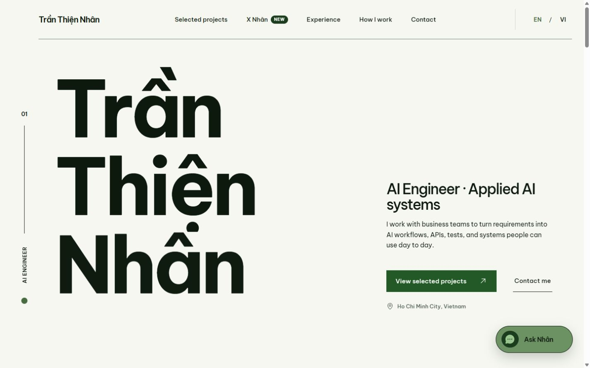
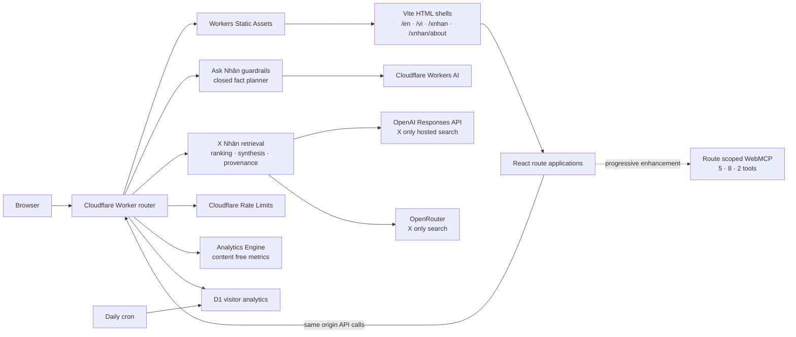

# tranthiennhan.com

The source behind [tranthiennhan.com](https://tranthiennhan.com): a bilingual AI engineering portfolio, the privacy bounded Ask Nhân assistant, the source linked X Nhân research experience, route scoped WebMCP tools, and a Cloudflare Workers edge backend.

[Explore the portfolio](https://tranthiennhan.com/en) · [Open X Nhân](https://tranthiennhan.com/xnhan) · [Read the privacy contract](docs/privacy.md) · [Report a security issue](SECURITY.md)



## Product surfaces

| Surface | Route | Purpose |
|---|---|---|
| English portfolio | `/en` | Selected work, experience, working style, and contact details |
| Vietnamese portfolio | `/vi` | First class Vietnamese presentation of the same public portfolio |
| Ask Nhân | Portfolio popup | Guarded answers from a closed, bilingual public fact catalog |
| X Nhân | `/xnhan` | Current topic research over source linked posts from X |
| X Nhân About | `/xnhan/about` | Product rationale, limits, and relationship to the official X API |

This is more than a static portfolio. Ask Nhân uses deterministic guardrails before any optional model planning, and the model never writes unrestricted public prose. X Nhân keeps provider choice explicit, requires a fresh retrieval attempt for every accepted question, fails closed when usable evidence is unavailable, validates canonical X links and source ownership, and never silently switches providers after a failure.

WebMCP is a progressive enhancement. The portfolio exposes five bounded tools, X Nhân exposes eight search and lifecycle tools, and X Nhân About exposes two editorial tools. Each catalog is registered only on its route, uses closed input schemas, and leaves the normal interface fully usable when `document.modelContext` is unavailable.

## Architecture



The Worker serves the built application and owns every browser facing API. The provider adapters, ranking pipeline, privacy boundaries, and route behavior are documented in [the architecture guide](docs/architecture.md).

## Technology

- React 19 and Vite 6 for the multi entry client application.
- Cloudflare Workers, Workers Static Assets, Workers AI, D1, Analytics Engine, and Rate Limiting.
- OpenAI Responses API and OpenRouter provider adapters for X only retrieval.
- Route scoped imperative WebMCP registration with lifecycle cleanup and bounded results.
- Node.js 24 and `pnpm@11.19.0` for reproducible local tooling.

## Getting started

### Prerequisites

- Node.js 24, matching [`.node-version`](.node-version).
- pnpm 11.19.0, matching the `packageManager` and `engines` fields in [`package.json`](package.json).

### Frontend development

```bash
pnpm install --frozen-lockfile
pnpm dev
```

`pnpm dev` starts the Vite interface only. It does not reproduce the Worker APIs.

### Local Worker parity

```bash
cp .dev.vars.example .dev.vars
pnpm dev:cloudflare
```

This builds the client, applies the checked D1 migrations to Wrangler's local database, and starts the local Worker. Fill `.dev.vars` only when a provider backed flow is intentionally required. Never commit that file. Provider calls can consume external allowance or incur cost; the automated test suite uses fixtures and does not need real provider credentials.

See [the development guide](docs/development.md) for the complete command map, local state behavior, and production safety boundary.

## Runtime configuration

The following provider values are server owned. The browser cannot select model IDs, send credentials, or override display labels.

| Name | Type | Required when |
|---|---|---|
| `OPENAI_API_KEY` | Secret | The OpenAI X Nhân provider is used |
| `OPENROUTER_API_KEY` | Secret | The OpenRouter X Nhân provider is used |
| `XNHAN_OPENAI_MODEL` | Runtime variable | The OpenAI X Nhân provider is used |
| `XNHAN_OPENROUTER_MODEL` | Runtime variable | The OpenRouter X Nhân provider is used |
| `XNHAN_OPENAI_MODEL_DISPLAY_NAME` | Optional runtime variable | A custom public label is desired |
| `XNHAN_OPENROUTER_MODEL_DISPLAY_NAME` | Optional runtime variable | A custom public label is desired |

Cloudflare bindings for static assets, Workers AI, D1, Analytics Engine, and four rate limiters are declared in [`wrangler.jsonc`](wrangler.jsonc). The checked generated contract in [`worker-configuration.d.ts`](worker-configuration.d.ts) is intentional source, not disposable build output.

## Verification

| Command | What it proves |
|---|---|
| `pnpm build` | Vite builds every entry and localized shells are generated |
| `pnpm test:content` | Focused bilingual content contracts pass |
| `pnpm test:worker` | Focused Worker and production configuration contracts pass |
| `pnpm check` | Production build and the complete Node test suite pass |
| `pnpm check:cloudflare-types` | Checked Cloudflare types match the current configuration |
| `pnpm verify:production` | Full check, types check, and a warning free Wrangler dry run pass |

`pnpm verify:production` is non deploying. `pnpm deploy:production` changes the live Cloudflare Worker and is reserved for an explicitly authorized maintainer operation with fresh preflight and post deployment verification.

## Repository map

```text
.
├── .github/             # Issue and pull request templates
├── d1-migrations/       # D1 visitor analytics schema
├── docs/                # Architecture, development, privacy, and preview assets
├── public/              # Static assets, redirects, headers, robots, and security.txt
├── scripts/             # Localized shell builder and Wrangler dry run gate
├── shared/              # Browser and Worker X Nhân contracts
├── src/                 # React apps, locale logic, WebMCP, and browser sessions
├── tests/               # Node regression and repository contract tests
├── worker/              # Worker router, APIs, providers, ranking, and analytics
├── index.html
├── xnhan.html
├── xnhan-about.html
├── vite.config.mjs
├── wrangler.jsonc
└── worker-configuration.d.ts
```

Generated directories such as `node_modules`, `dist`, `.wrangler`, coverage output, and browser test artifacts are deliberately excluded from the source handoff. Historical research packets and operational receipts live outside this repository.

## Privacy and security

- Ask Nhân and X Nhân conversation state is held in current tab memory and is not persisted by the application.
- The only browser persisted preference is an explicit locale choice.
- Application owned metrics exclude questions, answers, post text, source URLs, handles, request IDs, and conversation history.
- Cloudflare and the selected provider can still process platform and request data under their own active policies.
- Visitor analytics honors Global Privacy Control and exposes only a scalar aggregate publicly.

The exact data handling contract is in [`docs/privacy.md`](docs/privacy.md). Security reports must follow [`SECURITY.md`](SECURITY.md) and must not be filed as public issues.

## Contributing

Start with [`CONTRIBUTING.md`](CONTRIBUTING.md). Bug reports and focused design or documentation proposals are welcome. Code and asset pull requests are accepted only when the maintainer has invited the work or the repository licensing terms have been updated to permit contributions.

## License and asset rights

No project level software license has been selected. Until a canonical `LICENSE` file is added by the owner, this repository is published for inspection and default copyright rules apply. Public visibility does not grant permission to copy, modify, redistribute, or reuse the project outside the rights supplied by GitHub's platform terms and applicable law.

Third party dependencies keep their own licenses. Personal imagery and organization marks under `public/assets` are not covered by a software license and do not grant reuse or endorsement rights. See [`THIRD_PARTY_NOTICES.md`](THIRD_PARTY_NOTICES.md) for the current boundary.

## Maintainer

Trần Thiện Nhân · [LinkedIn](https://www.linkedin.com/in/clementtranbe) · [X](https://x.com/tran_thien_nhan)
