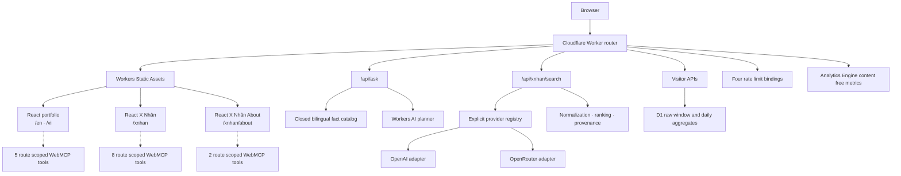

# Architecture

## System boundary

`tranthiennhan.com` is one Cloudflare Worker application with four public interface routes and a small set of same origin APIs. React owns the route interfaces, while the Worker owns static delivery, API validation, provider access, storage bindings, security headers, and operational metrics.

## Public routes

| Route | Application | Notes |
|---|---|---|
| `/` | Redirect | Sends visitors to `/en` |
| `/en` | Portfolio | English metadata, content, schema, and navigation |
| `/vi` | Portfolio | Vietnamese metadata, content, schema, and navigation |
| `/xnhan` | X Nhân | Search, answer, source list, activity, and transient follow up context |
| `/xnhan/about` | X Nhân About | Editorial product explanation and limitations |

The Worker canonicalizes `/xnhan/`, `/xnhan.html`, `/xnhan/about/`, and `/xnhan-about.html`. Only supported locale query state is retained during those redirects.

## Same origin application APIs

These endpoints support the website and are not presented as a general third party API.

| Endpoint | Methods | Responsibility |
|---|---|---|
| `/api/health` | `GET`, `HEAD` | Content free service health response |
| `/api/ask` | `POST` | Closed `{ locale, message }` Ask Nhân request |
| `/api/xnhan/search` | `POST` | Closed `{ locale, query, provider, history }` X Nhân request, returned as JSON or SSE |
| `/api/visit` | `POST` | Bounded visitor event; Global Privacy Control becomes a no op |
| `/api/visitor-count` | `GET`, `HEAD` | Scalar aggregate with source and timestamp metadata |

Unknown `/api/*` paths fail with a JSON `404`. API responses use `no-store`, and request handlers enforce method, same origin evidence, content type, body size, and exact fields as appropriate.

## Client applications

Vite builds three HTML entries: the portfolio, X Nhân, and X Nhân About. The postbuild script creates locale aware portfolio shells only, with synchronized portfolio metadata and `Person` JSON-LD. X Nhân and X Nhân About retain their dedicated entry shells and client locale logic.

Browser state follows these rules:

- Ask Nhân and X Nhân transcripts exist only in current React memory.
- X Nhân follow up history contains only bounded completed turns from the visible tab.
- Starting a new X Nhân chat, navigating away, or reloading clears that state.
- Only an explicit locale preference may be written to `localStorage`.
- Provider IDs, model IDs, display labels, credentials, and routing remain server owned.

## Ask Nhân

Ask Nhân is a collapsed bottom right launcher and popup. The Worker first applies deterministic guardrails and fact classification over an approved bilingual catalog. When a question needs model planning, Workers AI can select a closed plan made of approved fact IDs and relationships. The Worker validates that plan and renders approved text; the model does not directly author unrestricted public prose.

Portfolio WebMCP can open or close the dialog but cannot submit a question, read a transcript, obtain a verification token, or call a Worker API.

## X Nhân

X Nhân has two application providers, selected explicitly as `openai` or `openrouter`. A provider error stays with the requested provider and never triggers silent fallback.

Every accepted search follows the same high level pipeline:

1. Validate and normalize the closed browser request.
2. Resolve the selected provider and server owned model settings.
3. Retrieve current X sources through the provider specific adapter.
4. Canonicalize X status URLs and remove duplicates by status identity.
5. Rank evidence with query relevance, temporal intent, engagement signals, and soft author diversity.
6. Freeze a request local evidence catalog.
7. Validate the answer and source IDs against that catalog.
8. Return bounded result data with provider and resolved display metadata.

Prior conversation helps resolve follow up references but is never accepted as evidence and never replaces fresh retrieval for the current question. Hosted search can still be incomplete, delayed, or wrong; the interface keeps original source links available for inspection.

## WebMCP progressive enhancement

Tool registration occurs only when the browser exposes `document.modelContext.registerTool`. Unsupported browsers receive the complete ordinary interface without a WebMCP catalog.

| Route | Tool count | Boundary |
|---|---:|---|
| `/en`, `/vi` | 5 | Navigation, locale, dialog state, and a bounded public overview |
| `/xnhan` | 8 | Search, completed result snapshots, a text free result index, status, source navigation, locale, stop, and new chat |
| `/xnhan/about` | 2 | Trusted committed editorial overview and locale |

The adapters use closed schemas, route scoped registration, lifecycle cleanup, cancellation, bounded outputs, and fail closed provenance. They expose no credentials, private prompts, reasoning, deployment controls, raw analytics, browser storage, or unrestricted transcript reader.

## Cloudflare bindings

| Binding | Platform type | Role |
|---|---|---|
| `ASSETS` | Static Assets `Fetcher` | Built shells and static files |
| `AI` | Workers AI | Optional Ask Nhân plan selection |
| `VISITOR_ANALYTICS` | D1 | Short lived visitor rows and completed day aggregates |
| `ASK_NHAN_METRICS` | Analytics Engine | Content free Ask Nhân and X Nhân operational metrics |
| `ASK_NHAN_RATE_LIMIT` | Rate Limit | Ask Nhân admission |
| `VISITOR_RATE_LIMIT` | Rate Limit | Visitor write admission |
| `XNHAN_RATE_LIMIT` | Rate Limit | Per visitor X Nhân search admission |
| `XNHAN_INFERENCE_RATE_LIMIT` | Rate Limit | Global X Nhân inference admission |

Provider credentials are Cloudflare secrets. Provider model IDs and optional display names are server owned runtime variables. None is accepted from the browser.

## Data and observability

Application metrics are designed to be content free. They can include operation outcome, latency, provider or model identifiers, token and search counts when reported, retrieval shape, citation count, author diversity, timestamp coverage, and source age aggregates. They exclude questions, answers, post text, source URLs, handles, request IDs, IP addresses, user agents, and conversation history.

Visitor analytics is separate. It uses a bounded raw retention window, produces completed day aggregates, honors Global Privacy Control, and exposes only a scalar count publicly. See [`privacy.md`](privacy.md) for the durable contract and its platform limitations.

## Deployment configuration

[`wrangler.jsonc`](../wrangler.jsonc) is the configuration source of truth. It declares the canonical custom domain, Worker first static routes, bindings, migration chain, daily cron, rate limits, placement, compatibility settings, and observability state.

[`worker-configuration.d.ts`](../worker-configuration.d.ts) is generated by Wrangler and intentionally checked. `pnpm check:cloudflare-types` verifies that it has not drifted. A passing dry run proves only local deployment readiness; current production state requires an independent Cloudflare control plane and live HTTP verifier.
