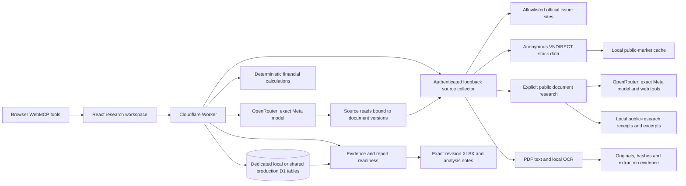

# Nhân for Securities

Nhân for Securities is an independent company-research workspace at `/securities`.
An investor chooses a stock, explores a business question, checks the supporting
evidence and keeps the result for further research. The same interface offers
guided questions, financial detail, source inspection and XLSX/Markdown exports.
It is maintained inside this website alongside the portfolio and X Nhân.

Public research covers the stocks returned by the HOSE/HNX/UPCoM directory, with
quotes, daily history, company profiles and an explicit action to find and read
public sources. FPT, GMD and VSC provide reviewed baseline report examples.
A listed stock or readable web excerpt does not establish
a verified financial dataset: unsupported filings and unresolved evidence remain
visible gaps. See [market data](securities-market-data.md) and
[source coverage](securities-sources.md).

The architecture walkthrough is at `/securities/architecture`, available in
[Vietnamese](https://tranthiennhan.com/securities/architecture?lang=vi) and
[English](https://tranthiennhan.com/securities/architecture?lang=en). It follows
an illustrative question through source reading, financial checks, calculation,
AI explanation and a saved report. The same paths work on the local server.

## Run locally

Use Node.js 24 and pnpm 11.19.0 from this repository:

```powershell
pnpm install --frozen-lockfile
pnpm dev:securities
```

Open `http://127.0.0.1:8788/securities?lang=vi` or use `lang=en`. The launcher
builds the client, applies only the dedicated local database migrations and
starts the Cloudflare Worker with `--local`. An occupied port is reported without
stopping another process. Use `--port 8790` to select another loopback port.
`--skip-build` is useful only when the current source has already been built.

The default mode keeps AI off. Anonymous public-market requests still occur;
selecting a stock does not invoke a model. A fresh checkout does not include
downloaded report originals or extraction files. Prepare the supported evidence
from the website directory:

```powershell
node scripts/securities/collect-sources.mjs --company=FPT
node scripts/securities/collect-sources.mjs --company=GMD
node scripts/securities/collect-sources.mjs --company=VSC
node scripts/securities/source-evidence.mjs --check
```

Collection downloads public issuer documents and runs local PDF text extraction
and OCR. It can take several minutes. The final command runs offline and checks
the preserved originals, extraction content, reviewed page images and committed
supplemental facts. It makes no model request and needs no private QA ledger.
Changed or missing evidence must be resolved before evidence-dependent research;
the check does not grant a new financial review. See [source setup](securities-sources.md)
for a separate corpus directory and extraction limits.

Live AI mode requires a passing local acceptance receipt. It reads the
parent-directory `key.txt` as inert text, accepting a raw key or
`OPENROUTER_API_KEY=...`:

```powershell
pnpm dev:securities --live --phase-a-receipt ../output/securities/qa/phase-a.json
```

Use a receipt for the checks described in [evaluation](securities-evaluation.md).
The model is fixed to `meta/muse-spark-1.3-contributor` through OpenRouter.
It is used only for explicit research or follow-up actions; failure never
silently selects another provider or model. A failed provider request remains
a failed request in its receipt.

The launcher creates a temporary private server configuration and environment
file outside the repository and served assets. It loads neither the existing
products' keys nor production AI/D1 bindings. Normal shutdown removes its
temporary files and stops only its own processes. Unexpected OS termination can
prevent temporary-file cleanup. The input key file is not modified.

Saved dossiers and source jobs live under `../output/securities/runtime/`.
Downloaded originals and extraction evidence live under
`../output/securities/sources/`. Restarting the launcher retains the local
database. The page URL contains the opaque dossier ID and selected revision;
opening it resumes that revision. The research library opens the latest saved
revision and can filter larger libraries by company, question or period.

## Shared production history

The checked Cloudflare configuration enables `SECURITIES_SHARED_MODE`. On an
authorized production release, the Worker maps the existing D1 binding to the
separate `securities_*` schema created by
`d1-migrations/0002_securities_shared_history.sql`. There is currently no
Securities account system: the saved-research list is common to all visitors,
every visitor can open it, and every visitor can delete an entry after an
explicit confirmation. A Cloudflare rate limit keyed from the anonymous network
address bounds public mutations without assigning user ownership. Visitors on a
shared network can therefore share the same limit.
This storage setting does not enable live model calls or authorize provider
spend; `SECURITIES_MODEL_MODE` remains a separate server-side decision.

Deletion is revision-bound and transactional. It refuses a stale library row or
an actively running dossier job, then removes the dossier, all immutable
revisions, approvals, model jobs and persisted follow-up conversations. A small
content-free idempotency record remains so a lost response can be retried safely.
The global processed-source catalog and externally preserved source artifacts
remain available to other research. The local launcher retains its dedicated
loopback database and the same delete control, without exposing its history to
the public site.

Earlier company-comparison migrations remain as historical schema. Their tables
and existing records are preserved; the application no longer exposes those
company-comparison workflows or endpoints.

The watchlist is separate from saved research. Its browser `localStorage` entry
contains only selected public stock identities: symbol, exchange and bounded
company names. Questions, answers, report contents and source excerpts are not
stored there. If storage is unavailable, the watchlist works for the current visit.
It does not contain report contents or schedule work.

Public market snapshots live under `../output/securities/runtime/public-market/`.
Explicit public-research audit records, source excerpts, provider receipts and
results live under `../output/securities/runtime/public-research/`. Both are
separate from the dossier's verified source data and immutable revisions.

## Research a listed stock

Search the stock picker by ticker or company name, optionally filter by HOSE,
HNX or UPCoM, and select a company. Its identity, latest returned quote, recent
daily closing-price history and available profile remain together. The picker
uses the paginated public stock directory and identifies incomplete coverage.
Ordinary market reads work while the AI model is off and require no Python SDK.

The selected quote refreshes every 30 seconds while the quote dataset is
selected, the market panel is open and the browser tab is visible. The investor
can pause and resume updates; resuming requests current data. Refresh also pauses
during source research. Its source date and available time are distinct from
local retrieval time. Units and the source clock timezone remain unknown when they
have not been verified. History excludes today's Vietnam calendar date, even
after market close. See [market data](securities-market-data.md) for the exact
cache and stale-response behavior.

The main form offers three intentions: **Understand the business**, **Examine
earnings quality**, and **Follow new disclosures**. Choosing an intention builds
an editable question from the current stock and, for a processed report, the
selected reporting and comparison periods.

The disclosures intention always uses public-source research. The other two
intentions use processed report analysis when an exact ticker and exchange match
exists; other stocks use public research and hide unavailable report periods.
**Find & read sources** searches public company and exchange pages with the
configured live AI model, returning links, matched excerpts and reading status.
This action is on demand and does not change a saved financial dossier.

An exact ticker and exchange match with supported original-document evidence
can use the dossier workflow below. A directory entry alone does not imply that
a verified dossier exists for that company or that its newest financial period
has been processed.

## Try research with ACB

1. Choose ACB from the directory or watchlist, then **Understand the business**.
   The suggested question asks about its activities, growth drivers and risks.
   Changing the stock, intention or report period resets the question to the
   relevant suggestion; an investor can edit it or restore the suggestion.
2. Start **Find & read sources**. Inspect the returned source dates, links and
   reading status. ACB currently uses public-source research; it does not have
   a processed financial dossier in the collection. An unread link or partial
   extraction must not appear as a complete, verified report.

## Work with a processed financial report

1. Select a company with processed reports, choose **Profit & cash flow**, then
   select the reporting and comparison periods. Start **Read & analyze**. The
   visible issuer and period selections bind the request. A custom question that conflicts with
   them produces a scope error instead of silently switching companies or
   periods. The application resolves the scope, saves the dossier and
   starts the AI job. An unsupported or ambiguous scope is explained before a
   model request. Progress, cancellation and retry reflect the actual job.
2. Read the report first. Its concise summary precedes the collapsed original
   question and detailed figures. Supported cash flow appears with the primary
   figures. The AI can read additional pages from the pinned source
   documents; its research record identifies actual reads and remaining gaps.
3. Ask a follow-up from the report. The question, answer, source reads and
   conversation remain attached to the selected dossier revision.
4. Open the detailed financial and evidence views when needed. They retain
   original precision, source versions, page images, formulas, accounting
   context, notes, corrections and history. A reasoned amendment creates a new
   revision and preserves the earlier one.
5. Export the selected report directly when its computed readiness allows it.
   Manual analyst approval is optional. A limited report explains unavailable
   analysis or excluded evidence; invalid inputs are not asserted as verified
   financial comparisons. Reload or reopen the saved report to resume it.
6. Use source updates to discover and reprocess official reports. A changed
   hash creates a new source version. Existing revisions retain their original
   evidence. Refreshing a dossier creates a new revision with the new sources.

The initial guided sources are explicitly frozen public reports, not a claim
that their periods are currently the newest available. The source catalog and
freshness result communicate the actual supported scope. An unsuccessful check
does not imply there is no newer report. Text extraction is distinct from
verified financial evidence. Unreliable OCR pages remain identifiable and
cannot become numerical authority merely because text was produced.

## Report readiness

The server computes readiness for the exact selected revision. A ready report
has usable evidence and current analysis that passed the implemented checks.
A limited report retains useful supported content and names its gaps or
exclusions, including when an AI answer is unavailable. An unavailable report
has no defensible report content to export. Human approval does not create
evidence or override these checks.

Natural language remains model output. Its numerical tokens resolve to exact
inputs or reproducible calculations, and an additional model consistency check
assesses the explanation against supplied evidence. That check is not an
independent audit or proof of investment performance. Research limitations are
shown alongside the result rather than turned into mandatory user review steps.

Historical reports remain readable. Older analysis without the current checks
is identified by its actual readiness and original model receipt. Optional past
approval events remain historical human actions, never automatic approvals.

## Architecture and data flow

The bilingual [architecture page](https://tranthiennhan.com/securities/architecture)
provides the product narrative and interactive system map. This repository
document describes the same local implementation for a technical reviewer.



- `src/securities` owns UI, controller, API client and the route's WebMCP adapter.
  Its `investor` directory owns guided intentions, public-market presentation,
  request lifecycle and the browser watchlist. Its `architecture` directory owns
  the separate bilingual architecture page.
- `shared/securities` owns source contracts, curated financial source data,
  decimal calculations, accounting compatibility, dossier transitions and the
  exact-revision report projection.
- `worker/securities` owns request validation, durable storage, source bridge,
  model adapter, server output validation and export generation.
- `d1-migrations/0002_securities_shared_history.sql` owns the production D1
  schema for the shared library; the local migration directory remains the
  source used by the dedicated launcher database.
- `scripts/securities` owns the safe local launcher, public-source collector,
  PDF/OCR processing and explicitly invoked real-API verification.
- The existing portfolio, Ask Nhân and X Nhân retain their modules and privacy
  contracts in this website. The local launcher creates no production resources
  or credentials.

The Node collector is necessary because local PDF rendering/OCR uses native and
WASM libraries outside workerd. Source-document work accepts issuer identifiers;
public market reads accept stock identity and a fixed dataset. Explicit public
research accepts a bounded question and locale for that stock. Callers cannot
provide arbitrary upstream URLs or filesystem paths. Its per-launch credential
never reaches the browser. The Worker validates dossier context and saves
imported source datasets into the separate D1 schema. Public snapshots and
reading excerpts stay outside that evidence ledger. Source instructions are
data throughout this flow.

## Verification and maintained references

`pnpm check` builds the website and runs the full repository regression gate.
`pnpm test:securities` runs the product's local tests; build first for shell
integration tests. Mock provider and fault fixtures are labeled in their tests.
`pnpm format:securities:check` checks the maintained Securities source, tests and
documentation formatting; `pnpm format:securities` applies that formatting.
Real browser/WebMCP, original-download and provider receipts are separate files
outside this repository. A successful local build or pre-deployment dry run does
not establish live production behavior or authorize deployment.

The offline source-reader command above verifies a collected corpus against the
committed evidence identities. The live report evaluator records its protocol,
implementation hash, original-source identities, selected questions, requested
and returned model, source reads, report checks, usage and known or unknown cost.
Its fixed questions are development regressions, not a blind holdout or a
market-wide accuracy estimate. Failed attempts remain part of the record.

Review a receipt together with the source pages and exported values for its
exact case. A source check, a software test, a model consistency verdict and a
human financial review establish different things. The [evaluation contract](securities-evaluation.md)
defines those boundaries and the prepare-only and explicitly invoked provider
test commands.

- [Source coverage, versions and extraction](securities-sources.md)
- [Exact model and OpenRouter adapter](securities-model.md)
- [Public directory, market snapshots and source research](securities-market-data.md)
- [WebMCP tools and revision semantics](securities-webmcp.md)
- [Frozen evaluation protocol](securities-evaluation.md)
- [Privacy and persistence boundaries](privacy.md)
